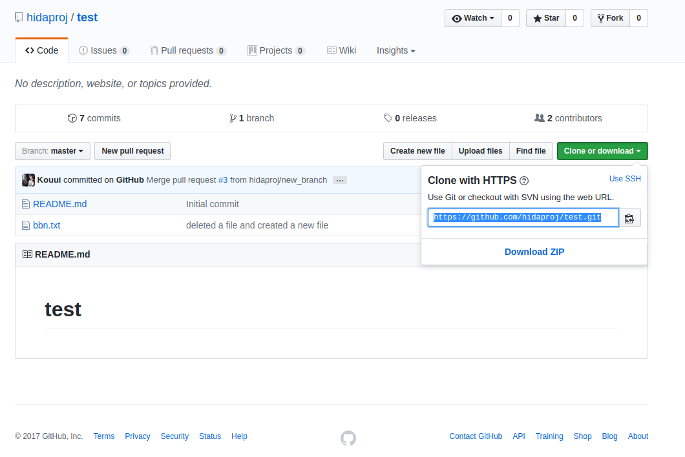

# collaboration using github
---

## adding a collaborator
---

[inviting collaborators to a personal repository](https://help.github.com/articles/inviting-collaborators-to-a-personal-repository/)

## the right way to edit a collaborated repository

althought you can edit repository directly in github if you are a collaborator of the repository. it is safer to clone the repository to your local machine and work on a new branch, since if you modify the master branch without notifying other collaborator, others' local master branch maight conflict with the remote one. 

so I sugguest all collaborators should work as follow steps, take repository *hidaproj/test* as an example

1. move to github repository *hidaproj/test*

2. click the green botton *Clone or download* on the right hand side, copy the link, which is https://github.com/hidaproj/test.git

3. go to your local work directory, open your terminal, type
        
        $ git clone https://github.com/hidaproj/test.git
