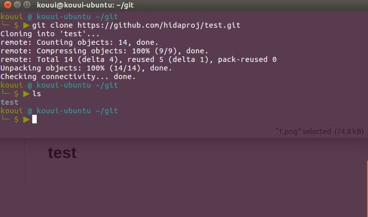
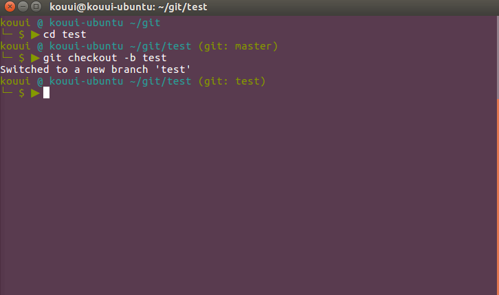
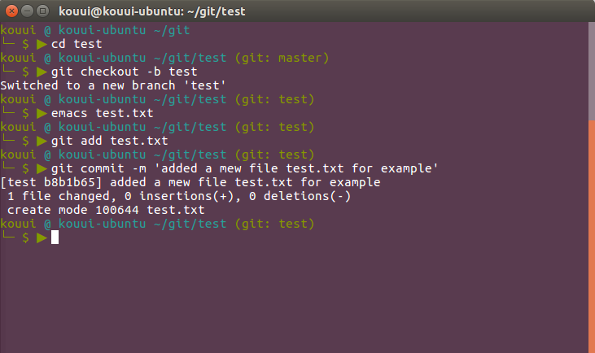
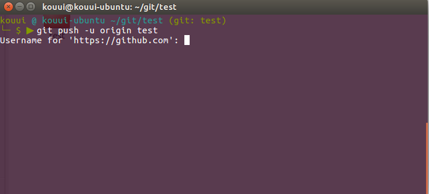
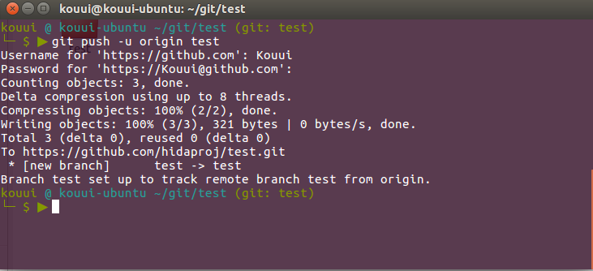
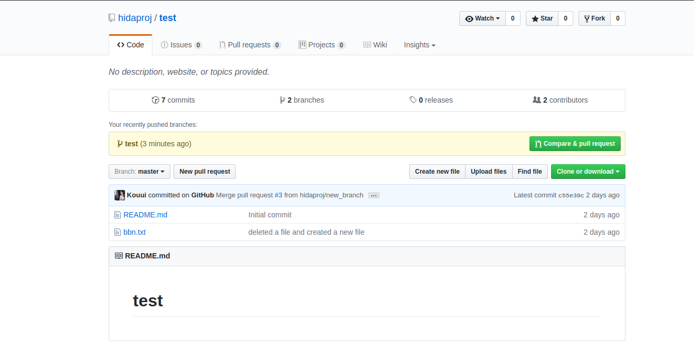
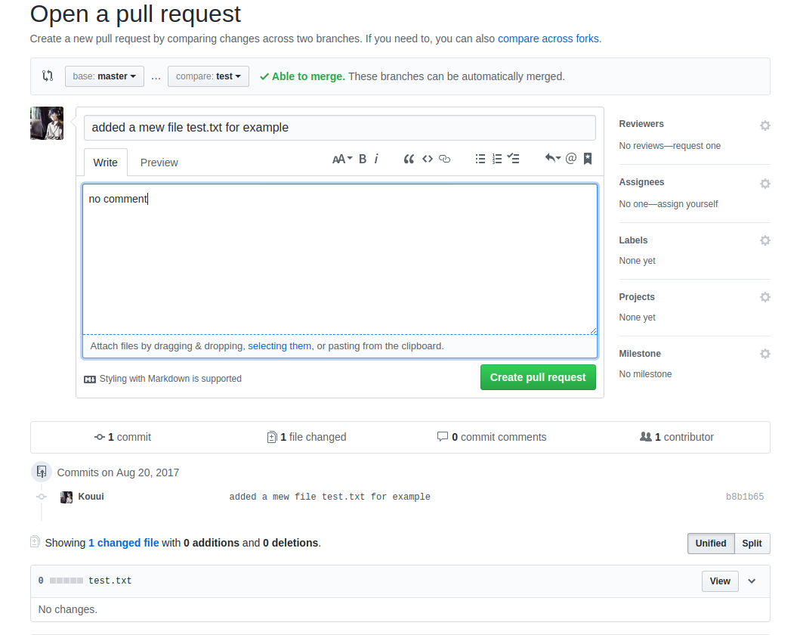
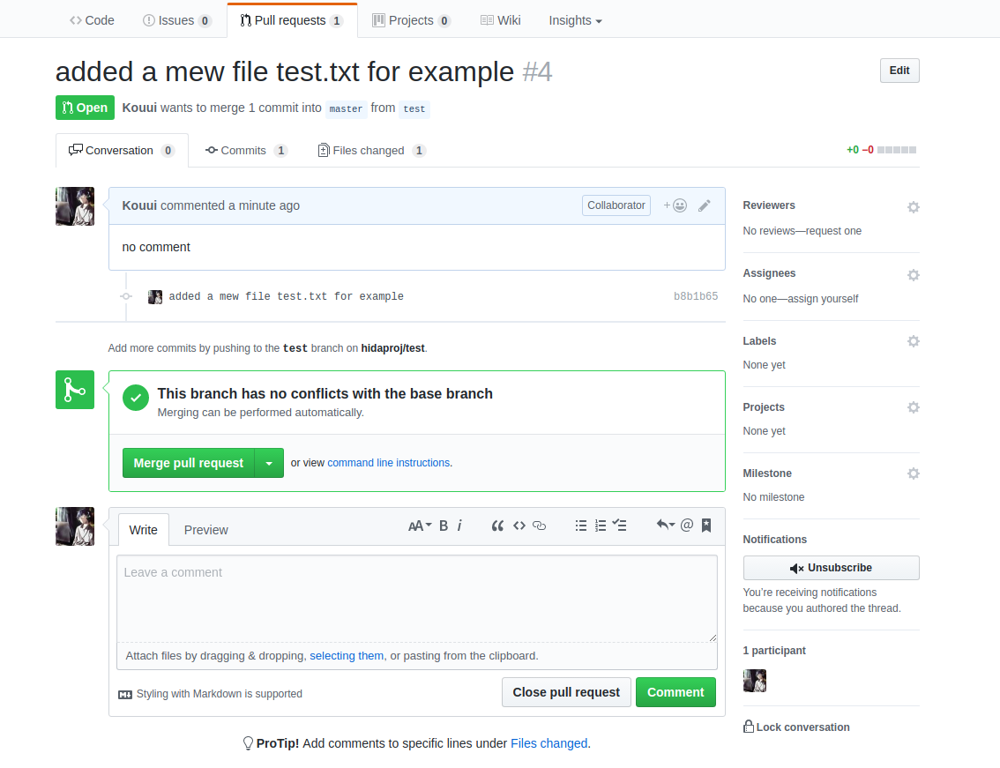
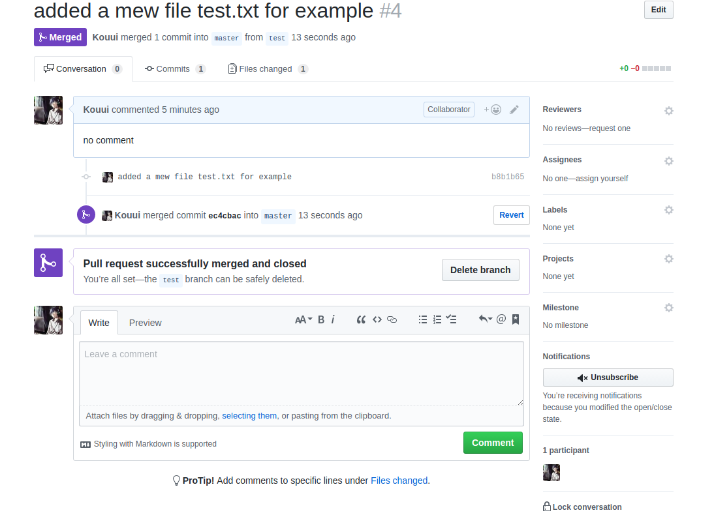

# collaboration using github
---

---
## adding a collaborator

[inviting collaborators to a personal repository](https://help.github.com/articles/inviting-collaborators-to-a-personal-repository/)

---
## the right way to edit a collaborated repository

althought you can edit repository directly in github if you are a collaborator of the repository. it is safer to clone the repository to your local machine and work on a new branch, since if you modify the master branch without notifying other collaborators, others' local master branch maight conflict with the remote one. 

so I sugguest all collaborators should work as follow steps, take repository *hidaproj/test* as an example

1. move to github repository *hidaproj/test*

[https://github.com/hidaproj/test](https://github.com/hidaproj/test)

2. click the green botton *Clone or download* on the right hand side, copy the link

3. go to your local work directory, open your terminal, download the whole repository as a folder
        
        $ git clone https://github.com/hidaproj/test.git
        

4. cd into the folder *test*, initialize and move into a new branch called *test*

        $ git checkout -b test

5. make some changes, for example creating a new file called *test.txt*, then add and commit
        
        $ git add test.txt
        $ git commit -m 'added a mew file test.txt for example'
        

6. since the cloned repository has already been linked to the remote server, you can push your newly created branch to the remote server, the command test below is the branch name you created

        $ git push -u origin test
        

7. enter your github username and password, then your branch will be uploaded 

8. go to github repository *hidaproj/test*'s webpage, you will find that master branch remained unchanged, and a notification of a new branch is uploaded 3 minutes ago.

9. click the green botton *Compare & pull request* on the right hand side in the figure above, you will see the diffrent between your branch and master branch as shown below. 

10. click green botton *Create pull request* shown in the figure above to let all collaborators know that a new branch is created. then other collaborators will pull the new branch *test* to their local machine to update their code.

11. if there is no conflicts between your *master* branch, you are able to merge the branches automatically by clicking the green botton *Merge pull request*, leave some message and click *Confirm merge*, then the consequent page is as follows

- if there is conflicts, the merge can only be done by the main collaborator *hidaproj* (in this case). 

12. after all collaborators have their local repository updated, click botton *Delte branch* .

        
